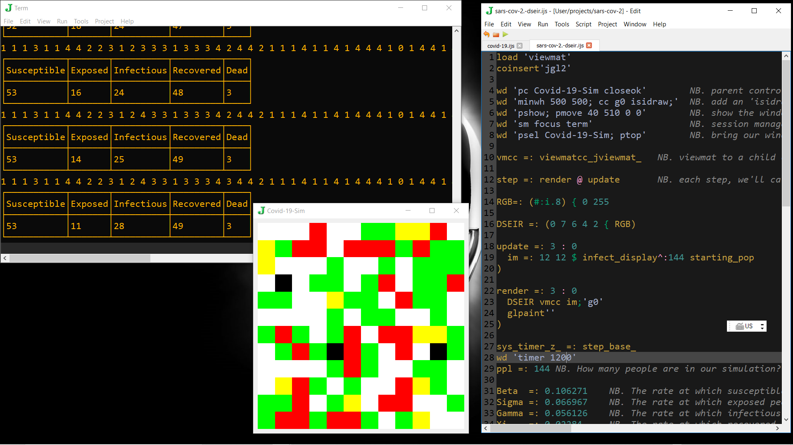
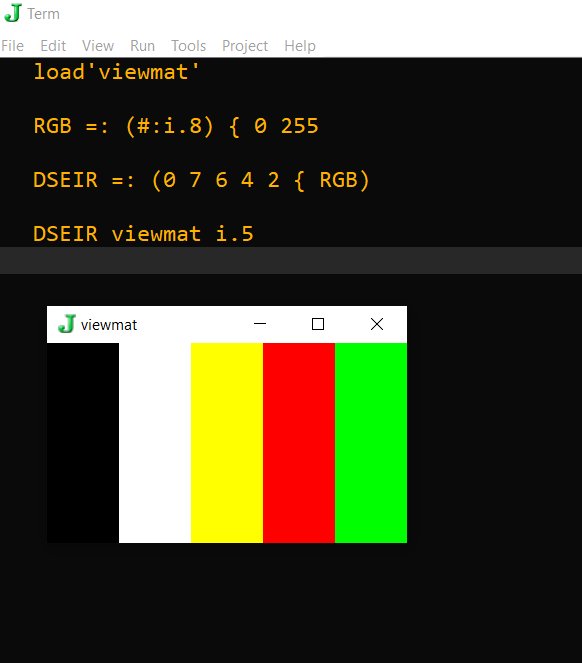

## sars-cov-2-DSEIR.ijs

This J code is mostly based upon Tyler Limkemann's Blog posting on Modeling the COVID-19 Outbreak with J:

https://datakinds.github.io/2020/03/15/modeling-the-coronavirus-outbreak-with-j

and gui code from tangentstorm's J-talks repository:

https://github.com/tangentstorm/j-talks

It is a mashup of the two references and my own glue in order to better understand the J language.
Like Tyler, I am not an epidemiologist either, and I cannot vouch for the validity of the model; it is only a learning exercise.

### Running the code

After you have loaded the file into J and hit run, edit the line:

```
wd 'timer 0'
```

to 

```
  wd 'timer 800'
```

and the blank gui window should start showing a matrix of color changes with WHITE=susceptible, YELLOW=exposed, RED=infectious, GREEN=recovered and BLACK=dead approximately every 800 ms.

To stop it without crashing your J session, change the timer to zero.

```
wd 'timer 0'
```

and with the cursor at the end of this line, hit CTRL-R to run it, and the gui will stop updating. You can now exit the gui window withouth crashing your J session and continue working in the J Edit and J Term windows.

I am still working out the kinks in the call:

```
infect^:144 starting_pop
```

...because the timer value restarts this 144 day simulation, and so it is graphing where ever it is at in the 144 day simulation in the gui loop.

You can view the J printout in the Term window by changing the update verb to:

```
update =: 3 : 0
  im =: 12 12 $ infect_display^:144 starting_pop
)
```

This will make things run slower, but you can compare the J Term  window's numerical output to the GUI window.



There are 144 people in the 12x12 gui matrix that should run over 144 days, but it keeps going.
I would like to make it so the matrix is in person order, so I can track an individual going through the state changes akin to a GOL (Game Of Life) simulation.

### Colors for DSEIR from RGB

It is fun to create the color map for the matrix in J.



```
RGB=: (#:i.8) { 0 255
'
DSEIR =: (0 7 6 4 2 { RGB)
```
#:  is 'ToBase2' and i.8 gives you the numbers 0 through 7 in binary, so the out put of (#:i.8) is:

```
0 0 0
0 0 1
0 1 0
0 1 1
1 0 0
1 0 1
1 1 0
1 1 1
```

{ 0 255  is ItemsFrom 0 255, so RGB is:

```
(#:i.8) { 0 255
  0   0   0
  0   0 255
  0 255   0
  0 255 255
255   0   0
255   0 255
255 255   0
255 255 255
```

Then you can pick the colors you want to represent DSEIR:

```
DSEIR =: (0 7 6 4 2 { RGB)
```

Which gives you Black, White, Yellow, Red, and Green to map to DSEIR (Dead Susceptible Exposed Infectious Recovered).

